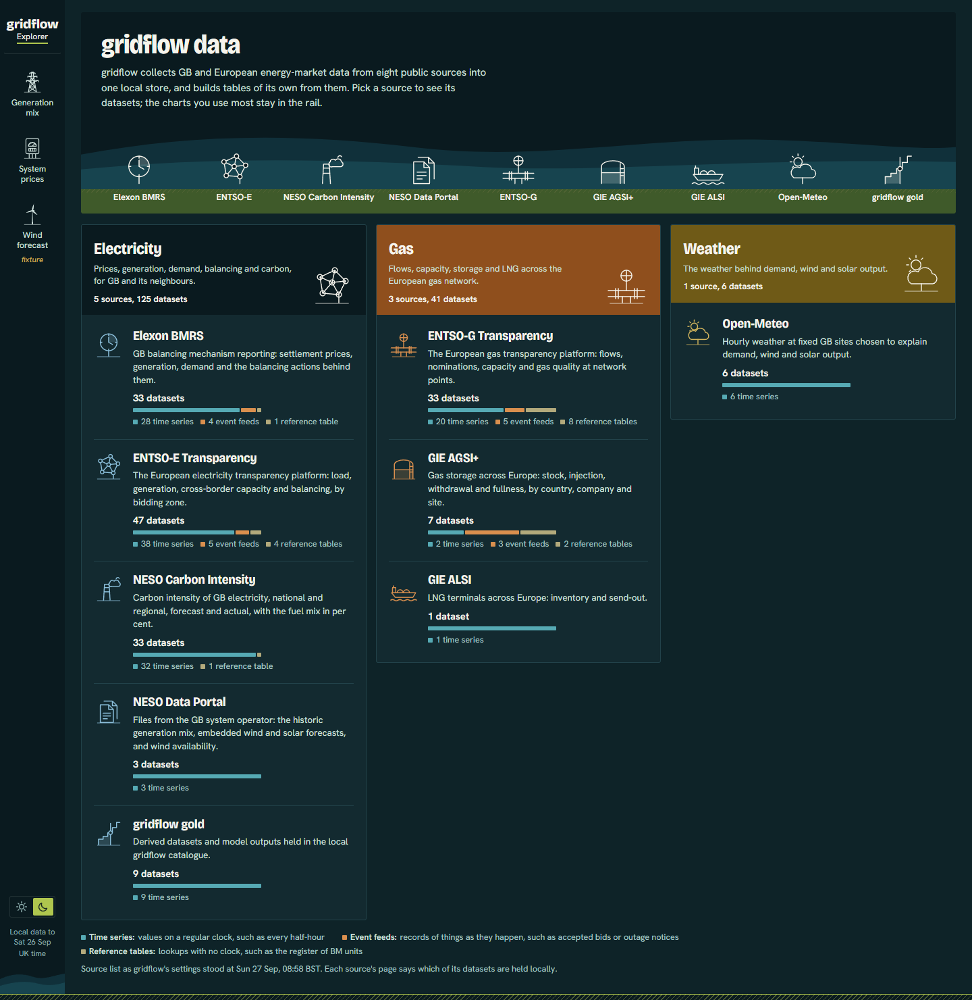
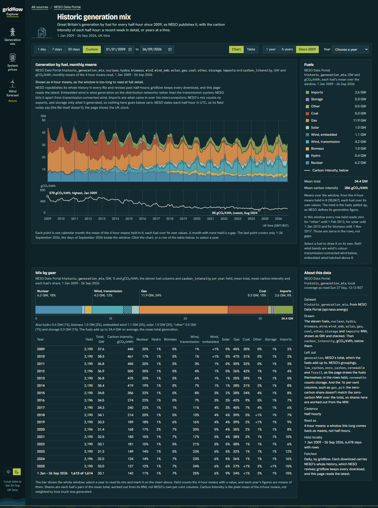
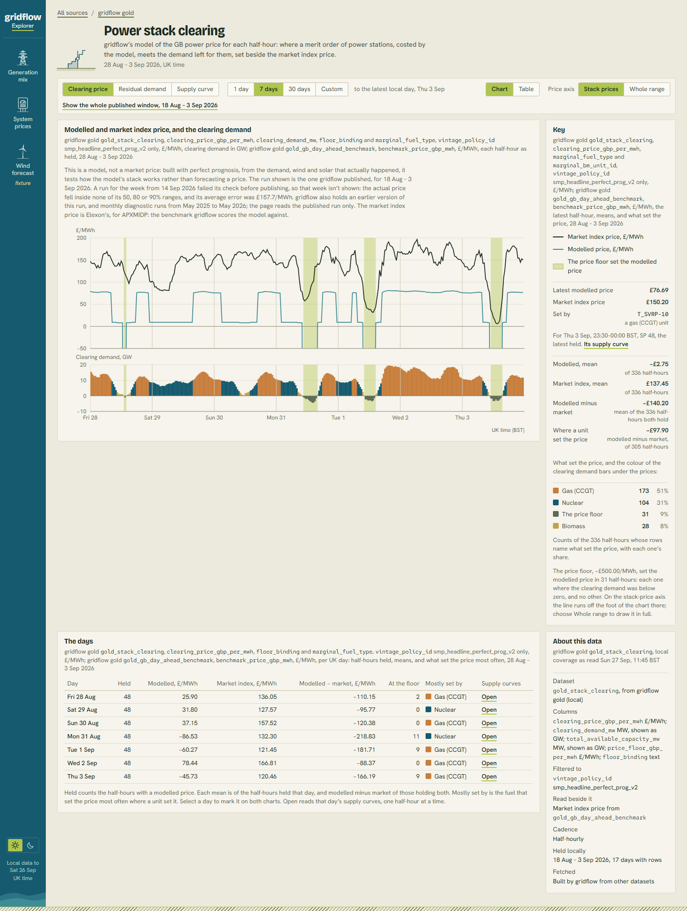
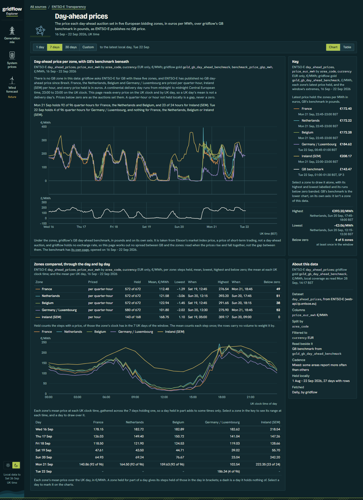
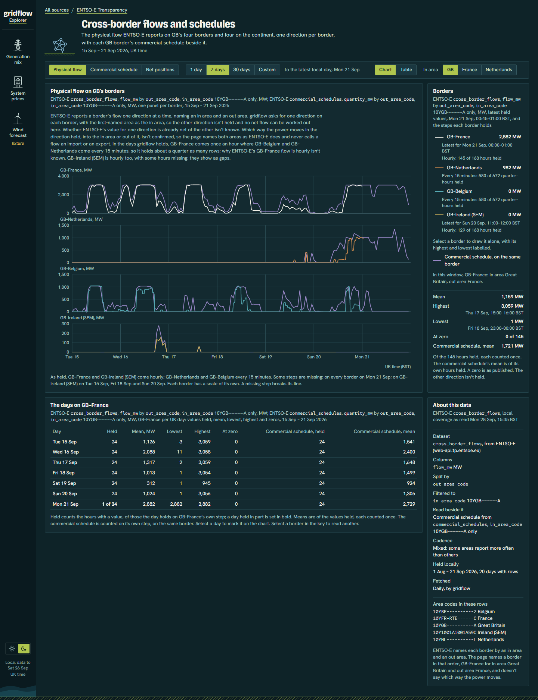
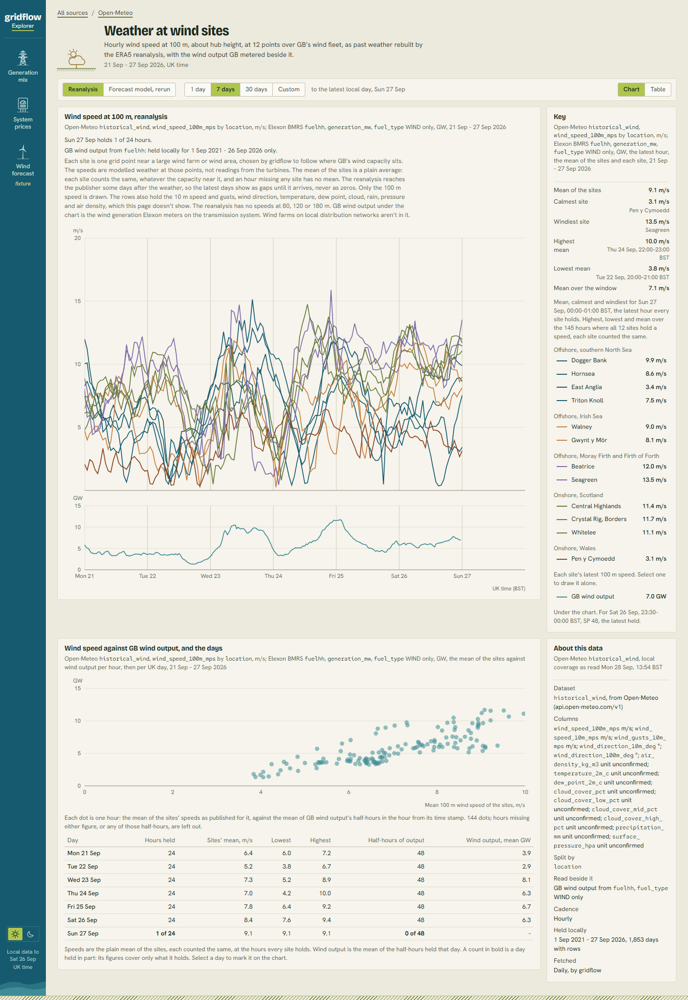

# gridflow Explorer

A React + TypeScript explorer over **[gridflow](https://github.com/EBentham/gridflow)**,
a self-built GB and European energy-market data platform. A FastAPI backend reads
gridflow's silver and gold layers through `GridflowClient` and serves them to a Vite
React-TS app. The app charts every dataset in the local store, from half-hourly GB
settlement prices to European gas storage, and it is honest about what the store holds
and what it doesn't.



**What's in it today**

- **A catalogue of 172 datasets from 9 sources:** Elexon BMRS, ENTSO-E, NESO Carbon
  Intensity, the NESO Data Portal, ENTSO-G, GIE AGSI+ and ALSI, Open-Meteo, and
  gridflow's own derived "gold" tables. It is built live from gridflow's source registry,
  so a dataset added to gridflow shows up here with no frontend change.
- **25 dataset pages, each on one shared template.** Every page has the same frame: a
  chart or table, a key, and an "about this data" panel naming the exact table, columns,
  units, cadence and local coverage. Bespoke pages add their own panels. Examples are the
  power-stack model against the market price, cross-border flows per border, and weather
  at wind farms plotted against metered GB wind output.
- **Light and dark themes, both designed properly.** The design system is locked in
  [`frontend/DESIGN.md`](frontend/DESIGN.md), with every colour, font and size in one
  token file.
- **Data honesty as a feature.** Gaps are drawn as gaps, never as zeros. Partial days are
  counted as partial. Revised data reads the latest vintage. Where the publisher's
  meaning is unconfirmed (units, flow direction, sign conventions), the page says so
  instead of guessing.
- **The original screens are still there:** generation mix, system prices, and day-ahead
  forecast runs from gridflow's companion modelling repo.
  Their coverage-aware fetch spots missing days and backfills them from the real
  connectors.

## Screenshots

| | |
|---|---|
| **Historic generation mix**: GB generation by fuel since 2009, with carbon intensity beneath it and a per-year breakdown.  | **Power stack clearing**: gridflow's merit-order model of the GB price against the market index price, coloured by the fuel that set it.  |
| **Day-ahead prices**: five European bidding zones with GB's benchmark on its own axis, and each zone's average daily shape.  | **Cross-border flows**: physical flow on each of GB's borders with the commercial schedule beside it.  |
| **Weather at wind sites**: 100 m wind speed at 12 points over GB's wind fleet against metered wind output.  | |

## Architecture

```
React 19 + TypeScript (Vite, Recharts, react-router)
   |
   |  /api/*   Vite dev-server proxy -> http://127.0.0.1:8000 (no CORS anywhere)
   v
FastAPI (single uvicorn worker)
   |  GET /api/sources                              the catalogue manifest
   |  GET /api/sources/{source}/{dataset}/rows      windowed, filtered, downsampled rows
   |  GET /api/datasets/..., /api/forecasts/...      the original screens
   |  POST /api/datasets/{id}/fetch                  backfill via the gridflow CLI
   v
GridflowClient (read-only)  ->  DuckDB catalogue  ->  Parquet silver/gold on disk
```

**The rows endpoint** is the part most of the app stands on. It works from gridflow's
source registry, so it knows every dataset's time column, grain and identity columns.

- It validates the whole query (window, filters, grouping) before touching DuckDB, so a
  bad request fails fast with a precise 4xx.
- It collapses revised publications to the latest vintage.
- It refuses to average across series that shouldn't be mixed, and asks the caller to
  filter or group first.
- It downsamples long windows into time buckets. The app can read 17 years of
  half-hourly generation as 4-hour means and say so on the chart.

**Built to stay responsive under load.**

- DuckDB reads are capped at 4 at once, so a burst of chart requests can't exhaust the
  server's thread pool and hang the health check.
- A queued request whose browser has already gone away is dropped (`499`) before it runs
  any query.
- The dev proxy runs without keep-alive, because reused sockets were hanging about one
  page load in five.

**Pages are configuration, not copies.** A page is a folder under
`frontend/src/views/<source>/<family>/`:

- The folder holds a typed view config, plus any bespoke panels the page needs.
- The registry discovers it with `import.meta.glob`, so the route and the catalogue link
  appear with no list to edit.
- The template owns the frame, loading, empty and error states, and every "held/not held"
  message, so all pages behave alike.
- The builder's contract is in [`frontend/src/views/README.md`](frontend/src/views/README.md).

**Coverage-aware fetch** is used on the generation-mix and system-prices screens.

- `GET /api/datasets/{id}/coverage` reports which days in view have no local rows.
- A banner offers to fetch them. That `POST`s a job that runs the `gridflow` CLI as a
  subprocess against the same catalogue.
- The UI polls `/api/jobs/current` until the job finishes, then refreshes the chart in
  place.
- While a fetch holds the write lock, read routes answer `503 refresh_in_progress`
  instead of racing DuckDB's file lock. A second fetch gets `409`.

**Tested.** The backend has a pytest suite of about 250 tests covering validation,
vintage collapse, downsampling, the concurrency cap and the fetch job lifecycle. The
frontend build type-checks under TypeScript 6 and lints with oxlint. A puppeteer
harness (`npm run shoot`) renders any route in both themes for visual review.

## Setup

The backend expects a checkout of [`gridflow`](https://github.com/EBentham/gridflow) as a
**sibling directory**, and a populated local gridflow catalogue:

```
some-parent-dir/
  gridflow/            <- sibling checkout
  gridflow-explorer/   <- this repo
```

gridflow is installed as an editable local path dependency. It isn't published on PyPI.
From `backend/`:

```sh
uv venv
uv pip install -e "../../gridflow" --python ./.venv/Scripts/python.exe
uv pip install -e ".[dev]" --python ./.venv/Scripts/python.exe
```

Copy `backend/.env.example` to `backend/.env` and set `GRIDFLOW_EXPLORER_DUCKDB_PATH` if
your catalogue lives somewhere other than gridflow's default.

From `frontend/`:

```sh
npm install
```

## Running

Backend (from `backend/`). It runs single-worker on purpose, because the fetch job state
is process-local:

```sh
./.venv/Scripts/python.exe -m uvicorn app.main:app --reload
```

Frontend (from `frontend/`), then open http://localhost:5173:

```sh
npm run dev
```

`EXPLORER_API` points the proxy at a backend on another port, and `VITE_PORT` moves the
dev server.

Tests and checks:

```sh
cd backend && ./.venv/Scripts/python.exe -m pytest -q
cd frontend && npm run build && npm run lint
```

## Related repos

- [`EBentham/gridflow`](https://github.com/EBentham/gridflow): the ingestion pipeline,
  the medallion store and the `GridflowClient` this app reads through.
- [`EBentham/gridflow-front-end`](https://github.com/EBentham/gridflow-front-end): the
  gridflow docs site, which shares this app's visual identity.
