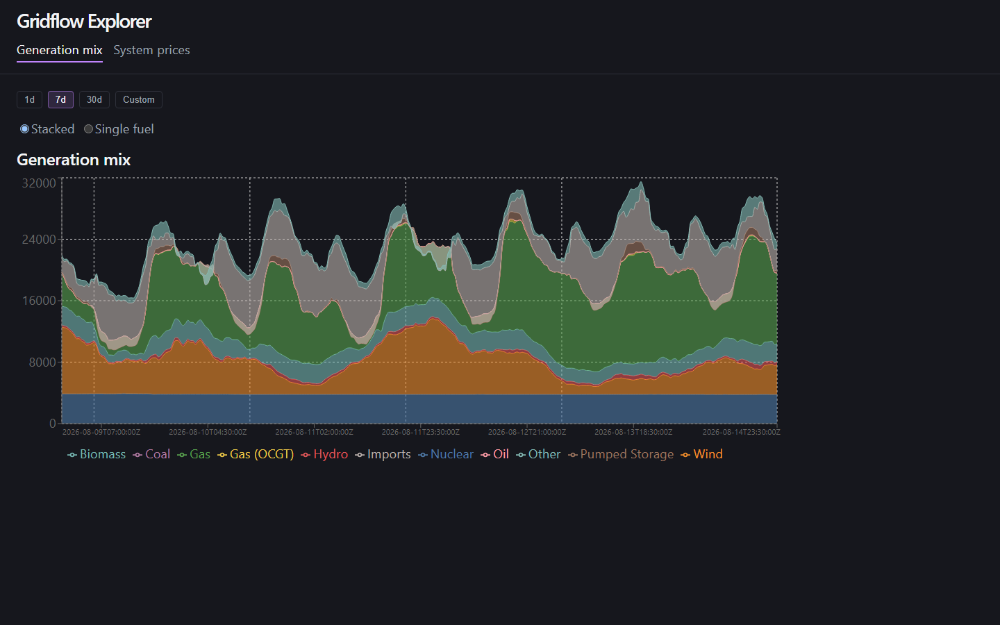
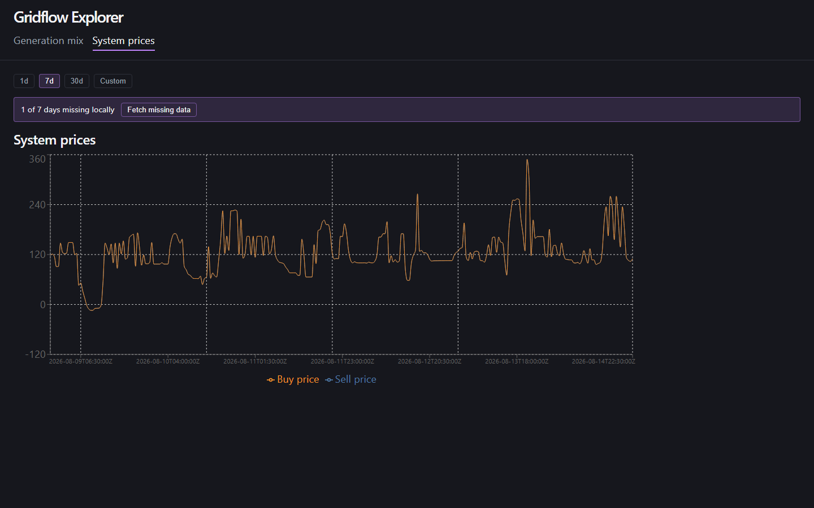

# gridflow-explorer

A React + TypeScript front-end over the [gridflow](https://github.com/EBentham/gridflow)
analytics layer: a FastAPI backend wraps `GridflowClient` and serves catalogued
GB electricity-market datasets (generation mix and system prices) to a Vite
React-TS app that renders them as live charts. When the local catalogue is
missing days for the range you're viewing, the app tells you exactly how many
days are missing and lets you fetch them — no manual CLI juggling required.

This is a local-first developer tool, not a deployed service: no auth, no
multi-user support, no hosting. It reads and writes a single local DuckDB
catalogue file on your machine.

## Architecture

```
React (Vite, TS)
   |
   |  /api/*  (Vite dev-server proxy -> http://localhost:8000, no CORS config anywhere)
   v
FastAPI (single uvicorn worker)
   |
   |  GridflowClient (read path)      subprocess: gridflow pipeline <source> <dataset> (write path)
   v                                        v
DuckDB catalogue  <----------------------- writes here too
   |
   v
Parquet (bronze/silver, on disk under the gridflow checkout)
```

Reads and writes are mutually exclusive by design: while a fetch job holds
the write lock, every read route (`/data`, `/coverage`) answers `503
refresh_in_progress` instead of racing DuckDB's file lock. `/api/datasets`
and `/api/jobs/current` touch no database at all, so the UI can keep polling
job status and the dataset list throughout a fetch. Fetch itself is
serialized to one job at a time — a second `POST .../fetch` while one is
running gets `409`, not a second subprocess. See
`.planning/phases/P1-PLAN.md` for the full job-runner design.

## The distinctive feature: coverage-aware fetch

Each screen calls `GET /api/datasets/{id}/coverage?start=&end=` for the
range it's showing. The response reports how many of the requested days
have *any* rows locally (`missing_dates`, `missing_day_count`). If days are
missing, a banner offers a **Fetch missing data** button that `POST`s
`/api/datasets/{id}/fetch`, which launches the `gridflow` CLI as a
subprocess against the same catalogue the API reads. The UI polls
`GET /api/jobs/current` (self-scheduling, not a bare `setInterval`, so a
slow tick can't overlap the next one) until the job finishes, then refetches
both the chart data and the coverage banner — no page reload.

Re-requesting days that are already present locally is safe for this app's
read paths specifically (duplicate-row tolerant aggregation and a
vintage-collapsed view for the two shipped datasets) — it is not a claim
that gridflow's own ingest is idempotent.

## Setup

This repo expects a checkout of [`gridflow`](https://github.com/EBentham/gridflow)
as a **sibling directory** — `../gridflow` relative to this repo's root
(i.e. `../../gridflow` relative to `backend/`, since the editable install
runs from there):

```
some-parent-dir/
  gridflow/            <- sibling checkout
  gridflow-explorer/   <- this repo
```

The backend installs `gridflow` as an editable local path dependency; it is
intentionally **not** a declared PyPI dependency (see
`backend/pyproject.toml`), since it isn't published there.

Install backend dependencies from `backend/`:

```sh
uv pip install -e ".[dev]" --system-certs
uv pip install -e "../../gridflow" --system-certs
```

`--system-certs` is required on this dev machine: Avast intercepts TLS and
breaks `uv`'s default certificate verification without it.

Copy `backend/.env.example` to `backend/.env` and adjust
`GRIDFLOW_EXPLORER_DUCKDB_PATH` if your catalogue lives somewhere other than
the placeholder path. Leaving it unset defers to gridflow's own `.env`
resolution.

Install frontend dependencies from `frontend/`:

```sh
npm install
```

## Running the two dev processes

Backend (from `backend/`, venv never activated — invoke the interpreter
directly):

```sh
./.venv/Scripts/python.exe -m uvicorn app.main:app --reload
```

Note: uvicorn is run **single-worker** (no `--workers` flag) — `app/jobs.py`
holds process-local job state that a multi-worker setup would defeat.

Frontend (from `frontend/`):

```sh
npm run dev
```

The Vite dev server proxies `/api` to `http://localhost:8000`, so there is no
CORS configuration anywhere in this project.

## Screenshots

Generation mix, with the coverage-aware fetch banner:



System prices:



## Related repos

- [`EBentham/gridflow`](https://github.com/EBentham/gridflow) — the
  ingestion pipeline and `GridflowClient` this app reads through.
- [`EBentham/gridflow-front-end`](https://github.com/EBentham/gridflow-front-end)
  — an earlier front-end over the same data layer.
